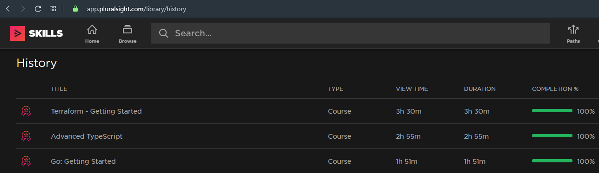
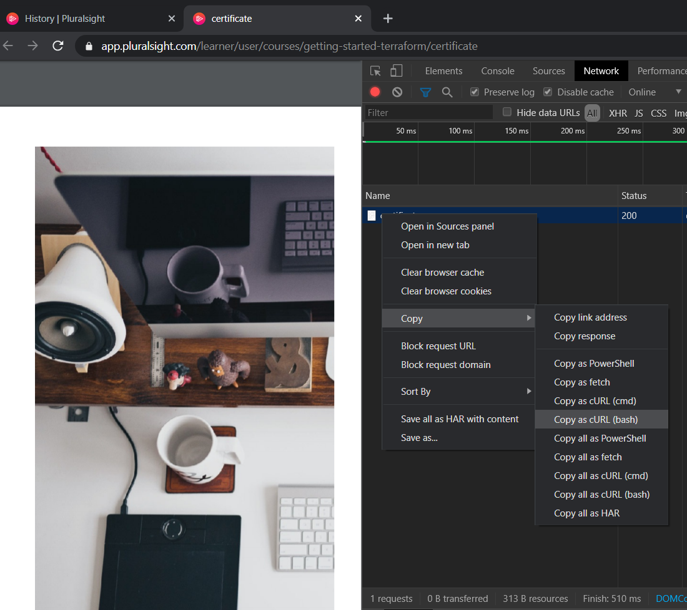

# Pluralsight Certificate Downloader

A dotnet core tool based on C# to download all your certificates from the [Pluralsight](https://pluralsight.com) video training platform.

* [How-To download you certificate manually](https://help.pluralsight.com/help/certificate-of-completion)
* [History of viewed courses](https://app.pluralsight.com/library/history)

Every time when you finish a video course on Pluralsight you earn a certificate. The certificates are available as PDF. To download your certificate you can review your history and click on the icon on the left side of each row. The default name is "certificate", which needs to be renamed for each download. That is fine for a few certificates but can be really time-consuming for many certificates. That is why I created this tool and shared it here on [PluralsightCertificateDownloader on GitHub by N7K4](https://github.com/N7K4/PluralsightCertificateDownloader).  



## Usage

### 1. Clone the repro in your workspace

```terminal
git clone https://github.com/N7K4/PluralsightCertificateDownloader.git ~/ws/PluralsightCertificateDownloader
cd ~/ws/PluralsightCertificateDownloader
```

The `~` is the shortcut for your home directory. In Windows it is something like `C:\Users\YOURNAME`.

### 2. Save the Pluralsight history as HTML file with a browser

Open your favorite web browser, e.g. Chrome, navigate to `https://app.pluralsight.com/library/history`, log-in if needed. Right click on the page choose "Save as ..." and pick a folder where you want to save the website. In my case I would pick `~/ws/PluralsightCertificateDownloader/downloads/history.html`.  

The HTML file and a folder with the name (extended with _files) will be created and the page is saved.

### 3. Get JWT Access Token from your web request

On the History page, click on icon of one of the finished courses, to open the PDF in a new browser tab.

Open the **Developer Tools**, on Google Chrome press `F12` and navigate to the Tab `Network` and set the Filter to `All`, press `Ctrl + R` to send the request again. In the call stack there will be a new line "certificate". Right Click on the line to open the context menu.



In the context menu choose the entry `Copy -> Copy as cURL (bash)` and paste the clipboard in a new text file. In the pasted text search for `PsJwt-production` and copy everything between the `=` to the `;`, that is your personal JWT token.

The JWT looks like a hash:

```text
abcdefghijklmoabcdefghijklmoabcdefgh.abcdefghijklmoabcdefghijklmoabcdefghijklmoabcdefghijklmoabcdefghijklmoabcdefghijklmoabcdefghijklmoabcdefghijklm.
abcdefghijklmoabcdefghijklmoabcdefghij-1234
```

**The JWT is like your Login-Data!** Take it with care! Do not publishing it and do not share it with others.

### 4. Run the application to download the certificates

```terminal
dotnet run --project ./PluralsightCertificateDownloader/PluralsightCertificateDownloader.csproj ./downloads/history.html "./downloads/" "YOUR_JWT_TOKEN"
```

**The JWT token will be in the history of your terminal!** The programm should be adapted that it will ask the user for the JWT as an secret input.

### 5. Review the list of certificates

In the folder `./downloads/` there will be the list of certificates in the format `yyyy-MM-dd-NAME-OF-VIDEO.pdf`.

## HTML Snippets

Simplified HTML of a [single row](./assets/SingleRowOfHistory.html) of the history. I dropped the img src and teh svg path to make the html more readable.  

```html
<div data-css-prsp0g="">
    <div data-css-uunkbn="" style="flex: 4 1 0%;">
        <a class="certificateIcon---H3J5h"
           href="https://app.pluralsight.com/learner/user/courses/getting-started-terraform/certificate"
           target="_blank"></a>
    </div>
    <div data-css-uunkbn="" style="flex: 40 1 0%;">
        <a href="/library/courses/getting-started-terraform"
           class="tableCourseLink---1pW0K">Terraform - Getting Started</a>
    </div>
    <div data-css-uunkbn="" style="flex: 9 1 0%;">Course</div>
    <div data-css-uunkbn="" style="flex: 9 1 0%;"><time datetime="PT3H30M21S">3h 30m</time></div>
    <div data-css-uunkbn="" style="flex: 9 1 0%;"><time datetime="PT12621.9844220S">3h 30m</time></div>
    <div data-css-uunkbn="" style="flex: 15 1 0%;">
        <div class="tableProgressBarContainer---26vee">
            <div class="progress-bar progress-bar--green progress-bar--border-radius-medium"
                aria-label="Percent Watched: 100">
                <div class="progress-bar__inner" style="width: 100%;"></div>
            </div>
        </div>100%
    </div>
    <div data-css-uunkbn="" style="flex: 10 1 0%;"><time datetime="01-28-2020">Jan 28, 2020</time></div>
    <div data-css-uunkbn="" class="tableContentContextMenu---2sEbd" style="flex: 4 1 0%;">
        <div class="contextMenu---1XRh4">
            <button data-css-z6g59z="" title="More Options">
                <div data-css-otejxm="" aria-label="More Options">
                    <svg role="img" aria-label="more icon" viewBox="0 0 24 24" xmlns="http://www.w3.org/2000/svg">
                        <path d="..."></path>
                    </svg></div>
            </button>
        </div>
    </div>
</div>
```

Inside the HTML there is a `a` with the class `certificateIcon---H3J5h`, here you can find the download link to the PDF of your certificate.  

Additional in the HTML block there are three `time` elements with the class `datetime`, the last one is formated as `MM-dd-yyy` and is the date when the certificated was earned.  

## CURL or WGET instead of "Save as inside the browser"

The history site on Pluralsight is **protected**.  

* When you download it via `curl` or `wget` you will see some obfuscated HTML.
* When you `view the sourcecode` of the website inside the browser and try to `copy & paste` it to a new file, you will loose all brackets.

In both cases the downloaded HTML is not ready to use it for this tool. So you have to open the history in the browser and choose "Save As ...".  

## Links

* [HTML Agility pack: parsing an href tag](https://stackoverflow.com/questions/8497673/html-agility-pack-parsing-an-href-tag)
* [Basic Auth in C# WebClient](https://stackoverflow.com/questions/28614985/c-sharp-webclient-http-basic-authentication-failing-401-with-correct-credentials)
* [Basic Auth in C# WebClient, return 404](https://stackoverflow.com/questions/16044313/webclient-httpwebrequest-with-basic-authentication-returns-404-not-found-for-v)
* [C# WebRequest using Cookies](https://stackoverflow.com/questions/4158448/c-sharp-webrequest-using-cookies)
* [HttpWebRequest with Basic Authentication (C#/CSharp)](https://stickler.de/en/information/code-snippets/httpwebrequest-basic-authentication)
